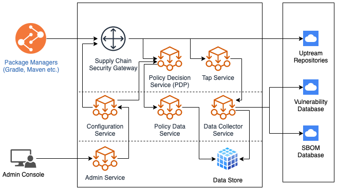
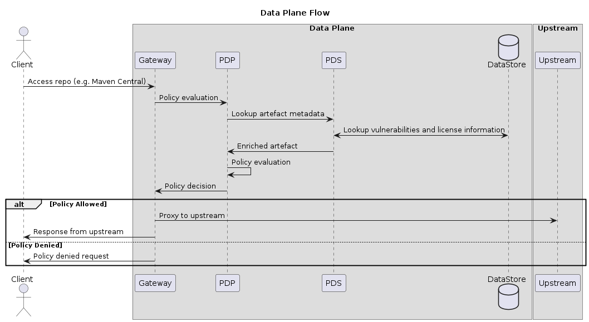

# SafeDep: Security Gateway

Security gateway can be used to establish policy control over consumption of 3rd party software components. [https://safedep.io](https://safedep.io) to get started with usage.

> This README is for Gateway developers. Refer to [https://safedep.io](https://safedep.io) for usage instructions for various environments and use-cases.

## TL;DR

Ensure git submodules are updated locally

```bash
git submodule update --init --recursive
```

Initialize keys and certificates for mTLS

```bash
./bootstrap.sh
```

> This will generate root certificate, per service certificates in `pki/`.

[TLS SAN](https://en.wikipedia.org/wiki/Subject_Alternative_Name) must be correctly set in the generated certificate for the mTLS to work correctly. Verify using:

```bash
openssl x509 -noout -text \
  -in ./pki/nats-server/server.crt | grep "DNS:nats-server"
```

Start the services using `docker-compose`

```bash
docker-compose up -d
```

Verify all the services are active

```bash
docker-compose ps
```

Use the gateway using a [demo-client](https://github.com/safedep/demo-client-java)

```bash
cd demo-clients/java-gradle && ./gradlew assemble --refresh-dependencies
```

At this point, you should see logs generated by gateway and the policy decision service and multiple artefacts that are violating configured policy are blocked by the gateway

```bash
docker-compose logs envoy
docker-compose logs pdp
```

The `gradle` build should fail with an error message indicating a dependency was blocked by the gateway.

```bash
> Could not resolve all files for configuration ':app:compileClasspath'.
   > Could not resolve org.apache.logging.log4j:log4j:2.16.0.
     Required by:
         project :app
      > Could not resolve org.apache.logging.log4j:log4j:2.16.0.
         > Could not get resource 'http://localhost:10000/maven2/org/apache/logging/log4j/log4j/2.16.0/log4j-2.16.0.pom'.
            > Could not GET 'http://localhost:10000/maven2/org/apache/logging/log4j/log4j/2.16.0/log4j-2.16.0.pom'. Received status code 403 from server: Forbidden
```

> Refer to `policies/example.rego` for the policy that blocked this artefact

Edit `config/gateway.json` and set `pdp.monitor_mode=true` to enable only monitoring and disable policy enforcement. Restart the containers for the changes to take effect.

```bash
docker-compose up --force-recreate --remove-orphans --build -d
```

Run the build again to see it compile successfully.

```bash
cd demo-clients/java-gradle && ./gradlew build --refresh-dependencies
```

## Architecture



### Data Plane Flow



## Usage

If you are developing on any of the service and want to force re-create the containers with updated image:

```bash
docker-compose up --force-recreate --remove-orphans --build -d
```

## Developer Documentation

* [Authentication](docs/Authentication.md)
* [Service Development](docs/Development.md)

## Contribution

Look at [Github issues](https://github.com/abhisek/supply-chain-security-gateway/issues)
